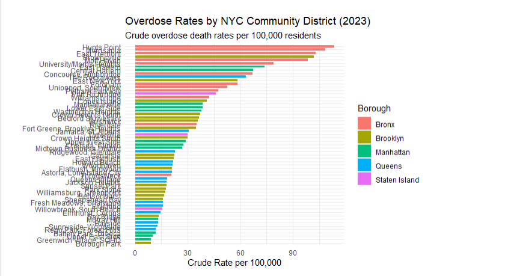
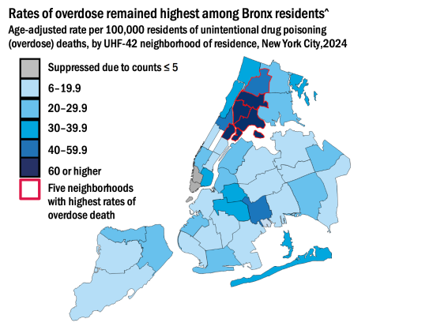
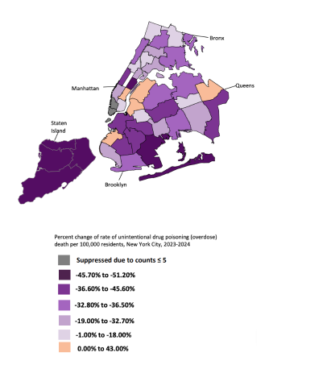
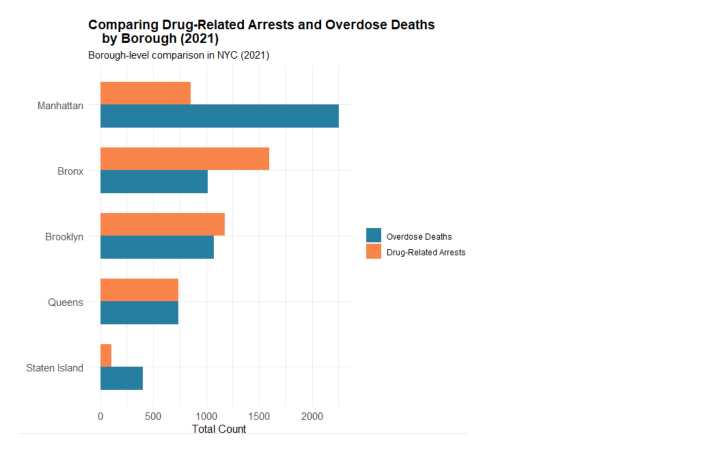
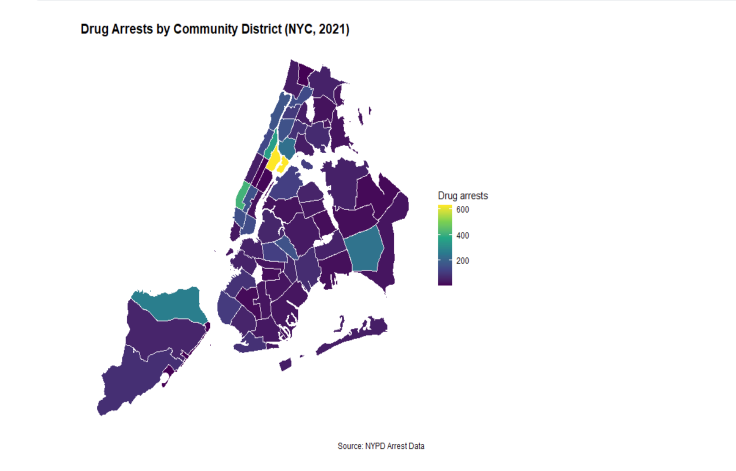
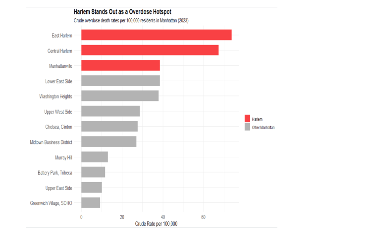
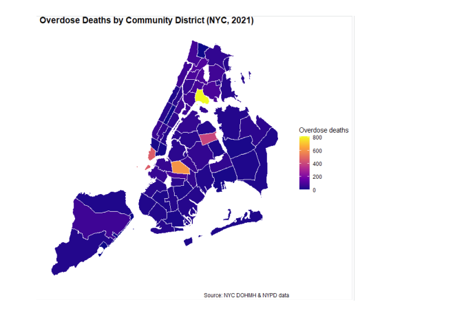

1 Introduction
New York City has experienced a sharp rise in overdose deaths over the past decade, reflecting the broader opioid and fentanyl epidemic occurring across the United States. The crisis intensified during and after the COVID-19 pandemic as overdose deaths reached record highs across many urban communities. In response, policymakers, public health officials, and law enforcement agencies have continued to debate the effectiveness of different strategies aimed at reducing overdose deaths, particularly the role of drug-related arrests and enforcement activity.

At first glance, the relationship between drug arrests and overdose deaths appears relatively straightforward. Areas with higher levels of drug enforcement often show lower overdose death rates in simple regression models, suggesting that arrests may reduce overdose activity. However, this relationship is difficult to interpret causally because law enforcement resources are often concentrated in neighborhoods already experiencing severe drug activity. As a result, arrests may respond to overdose risk rather than directly reducing overdose deaths. This creates a reverse causality problem that complicates simple regression analysis.

This study examines the relationship between drug arrests and overdose death rates across New York City community districts using fixed effects regression analysis and neighborhood-level overdose data. The analysis combines overdose death data from the New York City Department of Health and Mental Hygiene (DOHMH), drug arrest data from the New York Police Department (NYPD), and demographic and socioeconomic data from the American Community Survey (ACS) between 2013 and 2021.

The paper also expands beyond the regression analysis by examining more recent geographic overdose patterns throughout New York City using 2023 and 2024 DOHMH neighborhood overdose data. While the regression analysis focuses on long-run relationships between arrests and overdose deaths, the later descriptive analysis is used to examine whether overdose activity remains geographically concentrated within persistent hotspot regions. Together, these approaches help evaluate whether overdose deaths are more closely associated with enforcement levels or broader neighborhood conditions.

To examine this relationship more closely, this project uses panel data from New York City community districts between 2013 and 2021, combining overdose death data from the New York City Department of Health and Mental Hygiene, drug arrest data from the NYPD, and socioeconomic controls from the American Community Survey. Because some overdose counts were suppressed in the public health data, the analysis incorporates lower-bound, midpoint, and upper-bound overdose estimates to test the sensitivity of the results under different assumptions. The study uses fixed effects regression models to account for persistent neighborhood differences and broader citywide changes over time.

2 Background and Related Literature
The rise in overdose deaths across New York City has largely been driven by the increasing presence of fentanyl and other synthetic opioids within the drug supply. According to the New York City Department of Health and Mental Hygiene (2025), overdose deaths increased sharply beginning in the mid-2010s and accelerated further during the COVID-19 pandemic. Fentanyl became involved in overdose deaths throughout this period, contributing to record high mortality rates across many urban communities. The Department of Health and Mental Hygiene (2025) also notes that overdose deaths have disproportionately impacted neighborhoods facing higher levels of poverty, substance use, and limited access to healthcare resources. Recent research on overdose intervention strategies has also shifted attention toward more targeted public health approaches rather than traditional enforcement focused responses, particularly in neighborhoods experiencing persistent overdose hotspots.

Research on policing and drug enforcement has produced mixed conclusions regarding its effectiveness in reducing overdose deaths and drug activity. Supporters of enforcement based approaches argue that increased policing and drug arrests deter drug distribution and reduce the availability of dangerous substances in high-risk communities. These strategies are often connected to deterrence theory and “broken windows” style policing, which emphasize aggressive enforcement in areas experiencing high levels of crime and disorder. However, critics argue that arrest focused strategies fail to address underlying drivers of substance abuse, including poverty, homelessness, mental health conditions, and limited access to treatment.

In response to these limitations, recent research has increasingly focused on prevention based and public health approaches to reducing overdose deaths. Many of these strategies emphasize early intervention, treatment access, harm reduction services, and targeted outreach within high-risk communities. Programs centered around overdose prevention and coordinated care have shown promising results in reducing both fatal and non-fatal overdoses, particularly in neighborhoods experiencing persistent overdose activity. This shift toward targeted intervention strategies reflects a broader understanding that overdose risk is often shaped by local social and economic conditions rather than policing levels alone.

Given these competing explanations, this project uses regression analysis to examine the relationship between drug arrests and overdose deaths across New York City. The analysis begins with simple models before incorporating fixed effects and socioeconomic controls to account for broader neighborhood and citywide influences. To address suppressed overdose counts within the public health data, the study also tests multiple overdose assumptions to evaluate the consistency of the results across different specifications.

3 Data
This study combines overdose death data from the New York City Department of Health and Mental Hygiene, drug arrest data from the NYPD, and demographic and socioeconomic data from the American Community Survey between 2013 and 2021. The analysis focuses on overdose death rates and drug arrest rates across New York City neighborhoods while also incorporating controls for factors such as income, poverty, and unemployment. These variables were selected to account for broader economic and social conditions that may influence overdose risk and enforcement activity throughout the city.

Because some overdose counts were suppressed within the public health data to protect privacy in areas with low death counts, the analysis required additional assumptions when constructing overdose rate measures. To address this issue, the study estimates lower-bound, midpoint, and upper-bound overdose values for suppressed observations. This approach allows the analysis to test the sensitivity of the regression results under different assumptions regarding the missing data.

```{r}
#| label: setup
#| include: false

library(tidyverse)
library(readr)
library(modelsummary)
library(kableExtra)
library(knitr)
```


```{r}
model_data <- read_csv("C:/Users/jcas2/Downloads/jca100.github.io/model_data_rate_cd_2013_2021.csv")
```
Outcome variables:

overdose_deaths_reported_per_100k
overdose_deaths_lower_per_100k
overdose_deaths_midpoint_per_100k
overdose_deaths_upper_per_100k
Main explanatory variable:

arrests_total_per_100k_lag1
Control variables:

median_hhinc_10k
poverty_rate
unemp_rate
pct_black
pct_hispanic
pct_foreign_born

```{r}
library(modelsummary)
library(kableExtra)
```


```{r}
model_data %>%
  select(
    overdose_deaths_midpoint_per_100k,
    arrests_total_per_100k_lag1,
    median_hhinc_10k,
    poverty_rate,
    unemp_rate,
    pct_black,
    pct_hispanic,
    pct_foreign_born
  ) 
```
# A tibble: 531 × 8
   overdose_deaths_midpoi…¹ arrests_total_per_10…² median_hhinc_10k poverty_rate
                      <dbl>                  <dbl>            <dbl>        <dbl>
 1                     1.34                   58.0             11.3       0.0805
 2                     3.29                   70.5             11.8       0.0796
 3                     3.26                   71.0             12.0       0.0742
 4                     3.86                   74.4             12.4       0.0755
 5                     1.27                  172.              13.3       0.0779
 6                     1.29                  127.              14.0       0.0730
 7                     1.28                   54.3             14.8       0.0696
 8                     1.27                   43.0             15.4       0.0688
 9                     5.67                   15.9             16.1       0.0680
10                     6.04                  406.              11.3       0.0805
# ℹ 521 more rows
# ℹ abbreviated names: ¹​overdose_deaths_midpoint_per_100k,
#   ²​arrests_total_per_100k_lag1
# ℹ 4 more variables: unemp_rate <dbl>, pct_black <dbl>, pct_hispanic <dbl>,
#   pct_foreign_born <dbl>

```{r}
model_data %>%
  select(
    `Overdose deaths per 100k` = overdose_deaths_midpoint_per_100k,
    `Drug arrests per 100k, lagged` = arrests_total_per_100k_lag1,
    `Median household income ($10k)` = median_hhinc_10k,
    `Poverty rate` = poverty_rate,
    `Unemployment rate` = unemp_rate,
    `% Black` = pct_black,
    `% Hispanic` = pct_hispanic,
    `% Foreign born` = pct_foreign_born
  ) %>%
  datasummary_skim(
    output = "kableExtra",
    fmt = 2
  ) %>%
  kable_styling(full_width = FALSE)
```
4 Empirical Strategy
To better examine the relationship between drug arrests and overdose deaths, this study estimates a series of fixed effects regression models using New York City overdose and arrest data between 2013 and 2021. The primary analysis focuses on models using lower-bound, midpoint, and upper-bound overdose assumptions to account for suppressed overdose counts within the public health data. Additional socioeconomic controls are included to account for differences in poverty, income, and unemployment across neighborhoods. While several alternative model specifications were also tested throughout the analysis, the fixed effects framework provided the primary basis for evaluating the relationship between arrests and overdose death rates.


Where:

(OverdoseRate_{it}) is overdose deaths per 100,000 residents
(ArrestRate_{i,t-1}) is lagged drug arrests per 100,000 residents
(X_{it}) includes socioeconomic and demographic controls
(_i) captures community district fixed effects
(_t) captures year fixed effects
The inclusion of neighborhood fixed effects helps account for characteristics that remain relatively constant within neighborhoods over time. For example, long-term economic conditions, population density, and historical differences in drug activity. Year fixed effects are also included to account for other citywide shocks and trends, including changes in the fentanyl supply and the effects of the COVID-19 pandemic. Together, these controls help isolate the relationship between drug arrests and overdose deaths beyond broader structural differences across New York City.

```{r}
model_midpoint <- lm(
  log1p_overdose_deaths_midpoint_per_100k ~ 
    log1p_arrests_total_per_100k_lag1 +
    median_hhinc_10k + poverty_rate + unemp_rate +
    pct_black + pct_hispanic + pct_foreign_born +
    factor(boro_cd) + factor(year),
  data = model_data
)

modelsummary(
  list("Two-Way FE Model" = model_midpoint),
  coef_omit = "factor\\(",
  coef_map = c(
    "log1p_arrests_total_per_100k_lag1" = "Lagged drug arrests per 100k (log)",
    "median_hhinc_10k" = "Median household income ($10k)",
    "poverty_rate" = "Poverty rate",
    "unemp_rate" = "Unemployment rate",
    "pct_black" = "% Black",
    "pct_hispanic" = "% Hispanic",
    "pct_foreign_born" = "% Foreign born"
  ),
  stars = TRUE,
  vcov = ~ boro_cd,
  gof_omit = "IC|Log|RMSE|F",
  notes = "Community district and year fixed effects included. Standard errors clustered by community district."
)
```

5 Results
The initial regression results suggest a statistically significant negative relationship between drug arrests and overdose death rates across New York City. In the simpler model specifications, higher levels of drug enforcement were associated with lower overdose death rates. This relationship remained relatively consistent across the lower-bound, midpoint, and upper-bound overdose assumptions, suggesting that the overall pattern was not heavily influenced by how suppressed overdose counts were treated within the dataset. At first glance, these findings appear to support the argument that increased enforcement may reduce overdose activity.

```{r}
model_lower <- lm(
  log1p_overdose_deaths_lower_per_100k ~ 
    log1p_arrests_total_per_100k_lag1 +
    median_hhinc_10k + poverty_rate + unemp_rate +
    pct_black + pct_hispanic + pct_foreign_born +
    factor(boro_cd) + factor(year),
  data = model_data
)

model_upper <- lm(
  log1p_overdose_deaths_upper_per_100k ~ 
    log1p_arrests_total_per_100k_lag1 +
    median_hhinc_10k + poverty_rate + unemp_rate +
    pct_black + pct_hispanic + pct_foreign_born +
    factor(boro_cd) + factor(year),
  data = model_data
)

modelsummary(
  list(
    "Lower Bound" = model_lower,
    "Midpoint" = model_midpoint,
    "Upper Bound" = model_upper
  ),
  coef_omit = "factor\\(",
  stars = TRUE,
  vcov = ~ boro_cd,
  gof_omit = "IC|Log|RMSE|F|Adj"
)
```

However, the relationship changes once neighborhood and year fixed effects are incorporated into the regression models. After controlling for persistent neighborhood characteristics and broader citywide trends, the arrest coefficient becomes small and statistically insignificant across the primary model specifications. This suggests that the significant relationships observed in the earlier models were likely influenced by differences across neighborhoods and years rather than a clear direct effect of drug arrests on overdose deaths. Overall, the results indicate that overdose patterns across New York City are shaped by a combination of social, economic, and geographic conditions and not just policing levels alone.

Diagnostic tests were also conducted to evaluate the reliability of the regression models. Variance inflation factor (VIF) tests did not indicate severe multicollinearity among the primary explanatory variables. In addition, clustered standard errors were used throughout the analysis to help account for heteroskedasticity and repeated observations within neighborhoods over time. The consistency of the results across the lower-bound, midpoint, and upper-bound overdose specifications also supports the overall robustness of the findings.

The regression results suggested that broader neighborhood and time related factors played a larger role in explaining overdose patterns across New York City. As a result, the analysis next shifted toward geographic and neighborhood level trends throughout the city. Rather than being evenly distributed, overdose deaths appeared heavily concentrated within specific neighborhoods and hotspot areas.


```{r}
#| echo: false
#| fig-cap: "Overdose death hotspots across NYC community districts."


```
```
The neighborhood level overdose data further highlights the uneven distribution of overdose risk across New York City. Rather than being spread evenly throughout the city, overdose deaths are heavily concentrated within a relatively small number of communities. Seven of the eight neighborhoods with the highest overdose death rates are located within the Bronx and Northern Manhattan, while many other neighborhoods throughout the city report substantially lower overdose rates. This large variation across neighborhoods suggests that citywide averages hide important local differences in overdose risk.


```

```{r}
#| echo: false
#| fig-cap: "Overdose rates across Bronx community districts."


```


The geographic hotspot patterns make this concentration even more visible. Rather than appearing as isolated high-risk neighborhoods, many of the areas with the highest overdose death rates form a connected cluster surrounding the Harlem River between the Bronx and Northern Manhattan. Department of Health data from 2024 shows that all five neighborhoods with the highest overdose death rates were located within this broader hotspot region. This pattern suggests that overdose risk extends across neighborhood and borough boundaries within a concentrated corridor of elevated overdose activity.

While several neighborhoods continued to experience persistently high overdose death rates, other parts of New York City showed improvement over time. Staten Island stood out in particular due to the magnitude of its decline in overdose deaths between 2023 and 2024. Unlike the Harlem River hotspot, the significance of Staten Island was not driven by exceptionally high overdose rates, but rather by the unusually large reduction in overdose deaths observed over a relatively short period of time. This sharp decline prompted further examination into the local intervention strategies and public health responses implemented within the borough.

```{r}
#| echo: false
#| fig-cap: "Staten Island overdose hotspot analysis."


```

Further examination identified the Staten Island Hotspotting Program as one of the borough’s primary prevention based intervention strategies. The Hotspotting Program launched in January 2022 and was designed to identify and assist individuals at high risk of overdose before a crisis occurred. Rather than focusing on enforcement, the program used predictive analytics and coordinated outreach to connect participants with treatment services, recovery support, and additional healthcare resources. The program also emphasized continued follow up and care coordination, allowing intervention efforts to extend beyond a single encounter or referral. This approach reflects a shift toward prevention focused public health strategies aimed at reducing overdose risk through targeted intervention.

Taken together, the spatial and neighborhood level findings reinforce the limitations of interpreting overdose trends through enforcement patterns alone. While the regression models initially suggested a strong relationship between drug arrests and overdose deaths, the neighborhood analysis revealed that overdose risk remains highly concentrated within specific communities and hotspot regions across New York City. At the same time, Staten Island’s rapid improvement highlights how localized intervention strategies may influence overdose outcomes more effectively than broader enforcement efforts alone. These findings help show that overdose risk is shaped by a combination of geographic, social, and public health conditions that vary across neighborhoods throughout the city.


6 Conclusion
This study examined the relationship between drug arrests and overdose death rates across New York City using fixed effects regression models, neighborhood-level overdose data, and geographic hotspot analysis. Initial regression models suggested a significant negative relationship between drug arrests and overdose deaths. However, after incorporating neighborhood and year fixed effects, the relationship weakened substantially and became statistically insignificant across the primary model specifications. These findings indicate that broader neighborhood and time-related factors play a larger role in shaping overdose patterns than enforcement levels alone.

Overall, the findings show that overdose risk across New York City is highly concentrated rather than randomly distributed throughout the city. Although early regression models appeared to show a strong relationship between drug arrests and overdose deaths, the fixed effects models and neighborhood-level analysis indicate that enforcement often follows existing overdose activity rather than independently reducing it. The concentration of overdose deaths surrounding the Harlem River corridor further illustrates how persistent social and economic conditions shape localized overdose hotspots. At the same time, Staten Island’s rapid decline in overdose deaths demonstrates the potential effectiveness of targeted prevention-based intervention strategies. Together, these findings reinforce the idea that reducing overdose deaths requires more than increased enforcement alone. Public health resources, prevention efforts, and targeted intervention strategies are likely to have the greatest impact when focused within the communities facing the highest levels of overdose risk.


7 References
Estrada, Yarelix, et al. “The Prevalence of Fentanyl in New York City’s Unregulated Drug Supply as Measured through Drug Checking Offered at Syringe Service Programs.” Drug and Alcohol Dependence, vol. 268, 2025, p. 112578. https://www.sciencedirect.com/science/article/pii/S0376871625000316.

“Unintentional Drug Poisoning (Overdose) Deaths in New York City, 2025.” New York City Department of Health and Mental Hygiene, 2025, https://www.nyc.gov/assets/doh/downloads/pdf/epi/databrief150-unintentional-drug-death-2025.pdf

“Collaborative Care.” Staten Island Performing Provider System, Staten Island PPS Collaborative Care Program, https://statenislandpps.org/behavioral-health-programs/collaborative-care/

Unintentional Drug Poisoning (Overdose) Deaths.” NYC Open Data, New York City Department of Health and Mental Hygiene, NYC Open Data Overdose Dataset.

“NYPD Arrest Data (Year to Date).” NYC Open Data, New York City Police Department, NYC Open Data Arrest Dataset.

“American Community Survey (ACS).” United States Census Bureau, U.S. Department of Commerce, U.S. Census Bureau ACS


8 Appendix
```{r}
modelsummary(
  list(
    "Lower Bound" = model_lower,
    "Midpoint" = model_midpoint,
    "Upper Bound" = model_upper
  ),
  
  coef_omit = "factor\\(",
  
  coef_map = c(
    "log1p_arrests_total_per_100k_lag1" = "Lagged drug arrests per 100k (log)",
    "median_hhinc_10k" = "Median household income ($10k)",
    "poverty_rate" = "Poverty rate",
    "unemp_rate" = "Unemployment rate",
    "pct_black" = "% Black",
    "pct_hispanic" = "% Hispanic",
    "pct_foreign_born" = "% Foreign born"
  ),
  
  stars = TRUE,
  vcov = ~ boro_cd,
  
  gof_omit = "IC|Adj|Log|F|RMSE",
  
  add_rows = tibble::tribble(
    ~term, ~`Lower Bound`, ~Midpoint, ~`Upper Bound`,
    "Community District FE", "Yes", "Yes", "Yes",
    "Year FE", "Yes", "Yes", "Yes"
  ),
  
  notes = "Standard errors clustered by community district."
)
```

```{r}
#| echo: false
#| fig-cap: "Comparison of drug arrests and overdose deaths across NYC neighborhoods."


```
```{r}
#| echo: false
#| fig-cap: "Drug arrest patterns by community district."


```

```{r}
#| echo: false
#| fig-cap: "Harlem overdose hotspot analysis."


```

```{r}
#| echo: false
#| fig-cap: "Overdose deaths by NYC community district."


```


