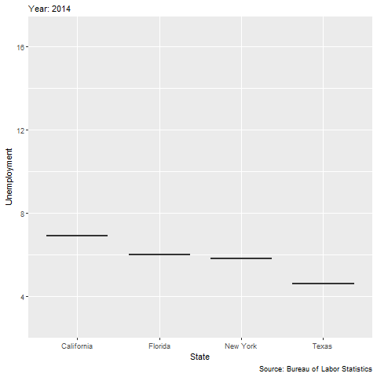
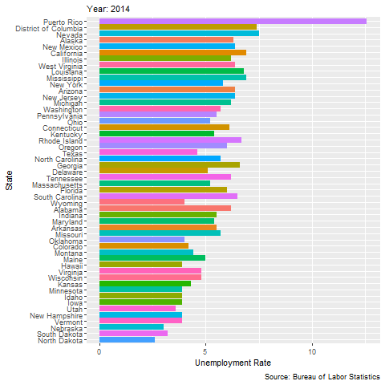

```{r}
library(ggplot2)
library(readr)
library(tidyverse)
library(dplyr)
library(lubridate)
library(reticulate)
library(gganimate)
library(ggmap)
library(sf)
library(tigris)
library(ggthemes)
library(gapminder)

test <- read_csv("C:/Users/jcas2/Downloads/Unemployment_by_state - Sheet1 (1).csv")
test <- test |>
  mutate(across(-1,as.numeric))
u3 <- test |>
  pivot_longer(cols = -1,
               names_to = "date",
               values_to = "unemployment")

u3$date <- str_replace(u3$date," "," 01 ")
u3$date <- mdy(u3$date)

datelist=mdy(c("Dec 01 2014","Dec 01 2015","Dec 01 2016","Dec 01 2017","Dec 01 2018","Dec 01 2019","Dec 01 2020","Dec 01 2021","Dec 01 2022","Dec 01 2023","Dec 01 2024"))
```

```{r}
#| eval: false
# gapminder_sum <- gapminder |>
#   group_by(year) |>
#   arrange(year, desc(gdpPercap)) |>
#   mutate(ranking = row_number()) |>
#   filter(ranking <=15)

data_1 <- test

test <- data_1 |> 
  mutate(`Mar 2020` = as.numeric(`Mar 2020`),
         `Apr 2020` = as.numeric(`Apr 2020`)
  ) |> 
  pivot_longer(cols = `Dec 2014`:`Jan 2023`,
               names_to = 'time',
               values_to = 'UnemploymentRate') |> 
  select(State, time, UnemploymentRate) |> 
  mutate(monthly = my(time)) |> 
  arrange(monthly, desc(UnemploymentRate)) |>
  group_by(monthly) |> 
  mutate(ranking = row_number()) |>
  filter(ranking <=15)

p <- test |>
  ggplot() +
  geom_col(aes(x = ranking, y = UnemploymentRate, fill = State)) +
  geom_text(aes(x = ranking, y = UnemploymentRate, label = as.character(round(UnemploymentRate, 1))), 
            hjust=-0.1) +
  geom_text(aes(x = ranking, y = 0 , 
                label = State,
                group = State), hjust=1.1) + 
  geom_text(aes(x = 18, 
                y = max(UnemploymentRate)*.85, 
                label = as.factor(monthly),
                group = State),   
            vjust = 0.2, alpha = 0.5,  color = "gray", size = 20) +
  coord_flip(clip = "off", expand = FALSE) + 
  scale_x_reverse() +
  scale_fill_viridis_d() +
  theme_minimal() + 
  theme(
    panel.grid = element_blank(), 
    legend.position = "none",
    axis.ticks.y = element_blank(),
    axis.title.y = element_blank(),
    axis.text.y = element_blank(),
    plot.margin = margin(1, 4, 1, 3, "cm")
  )

anim <- p +
  transition_states(monthly, state_length = 0, transition_length = 3) +
  enter_fade() +
  exit_fade() + 
  ease_aes('quadratic-in-out') 
p_anim <- animate(anim, 
                  width = 700, height = 432, 
                  fps = 25, duration = 25, 
                  rewind = FALSE)

p_anim

# anim_save("C:\\Users\\jcas2\\Documents\\anim_out5.gif", p_anim)
```

```{r}
knitr::include_graphics("C:\\Users\\jcas2\\Documents\\anim_out5.gif")
```

Source: Bureau of Labor Statistics

Data:

-   Unemployment Rate (defined as the percentage of the labor force who are unemployed and actively seeking work)

-   Measured monthly from December 2014 to December 2024 across every U.S. State

# Statistics per State

## Row {height = 50%}

```{r}
#| title: Summary Statistics per State

state_sum <- u3 %>% 
  group_by(State) %>% 
  summarize(avg_u3=mean(unemployment,na.rm=TRUE),
            med_u3=median(unemployment,na.rm=TRUE),
            min_u3=min(unemployment,na.rm=TRUE),
            max_u3=max(unemployment,na.rm=TRUE),
            var_u3=var(unemployment,na.rm=TRUE))

state_sum

top_u3_state <- state_sum %>%
                arrange(desc(avg_u3))
```

```{r}
#| title: Example Data

head(u3,50)
```

## Row {height = 50%}

```{r}
#| content: valuebox
#| title: "Which U.S. State Has the Highest Unemployment?"

list(
  icon = "arrow-up-square-fill",
  color = "danger",
  value = "Puerto Rico: 8.686"
)
```

```{r}
#| content: valuebox
#| title: "Which U.S. State Has the Lowest Unemployment?"

list(
  icon = "arrow-down-square-fill",
  color = "success",
  value = "North Dakota: 2.704"
)
```

# Statistics by Year

## Row {height = 50%}

```{r}
#| title: Summary Statistics per Year

state_sum <- u3 %>% 
  group_by(year(date)) %>% 
  summarize(avg_u3=mean(unemployment,na.rm=TRUE),
            med_u3=median(unemployment,na.rm=TRUE),
            min_u3=min(unemployment,na.rm=TRUE),
            max_u3=max(unemployment,na.rm=TRUE),
            var_u3=var(unemployment,na.rm=TRUE))

state_sum

top_u3_year <- state_sum %>%
               arrange(desc(avg_u3))
```

```{r}
#| title: Example Data

head(u3,50)
```

## Row {height = 50%}

```{r}
#| content: valuebox
#| title: "Which Year Has the Highest Unemployment?"

list(
  icon = "arrow-up-square-fill",
  color = "danger",
  value = "2020: 7.423"
)
```

```{r}
#| content: valuebox
#| title: "Which Year Has the Lowest Unemployment?"

list(
  icon = "arrow-down-square-fill",
  color = "success",
  value = "2023: 3.374"
)
```

# Plots

## Row {height = 50%}

```{r}
#| title: Unemployment Trends in Prominent States

u3 |>
  subset(State %in% c("New York","Florida","Texas","California")) |>
  subset(date %in% datelist) |>
  ggplot() +
  geom_col(aes(x=year(date),
               y=unemployment,
               fill=State,
               group_by=State),
           position='dodge') +
  geom_smooth(data=u3 |>
                subset(date %in% datelist),
              aes(x=year(date),
                  y=unemployment),
              color='black') +
  labs(caption="Source: Bureau of Labor Statistics",
       x='Year',
       y='Unemployment Rate')
```

```{r}
#| eval: false
p3 <- ggplot(data=u3 |>
         subset(State %in% c("New York","Florida","Texas","California")) |> 
           mutate(year = as.integer(year(date))),
       mapping=aes(x=State,
                   y=unemployment,
                   fill=State)) +
  geom_boxplot() +
  transition_time(year) +
  labs(caption="Source: Bureau of Labor Statistics",
       subtitle="Year: {(frame_time)}",
       x='State',
       y='Unemployment') +
  theme(legend.position='none')

animate(p3,nframes=40,fps=4)

anim_save("C:\\Users\\jcas2\\Documents\\unemp_trend.gif", p3)


```

```{r}
#| title: Unemployment Trends in Prominent States


```

## Row {height = 50%}

```{r}
#| eval: false


p2 <- u3 |>
  subset(date %in% datelist) |>
  mutate(year = as.integer(year(date))) |> 
  ggplot() +
  geom_col(aes(x=unemployment,
               y=reorder(State,unemployment),
               fill=State),
           position='dodge') +
  transition_time(year) +
  theme(legend.position='none') +
  labs(caption="Source: Bureau of Labor Statistics",
       subtitle="Year: {(frame_time)}",
       x='Unemployment Rate',
       y='State')

animate(p2,nframes=40,fps=4)
anim_save("C:\\Users\\jcas2\\Documents\\unemp_state.gif", p2)

```

```{r}
#| title: How unemployment varies in every U.S. state



```

```{r}
#| title: U.S. Country Map

```

```{r}
# us_states <- states(
#   cb         = TRUE,   # use generalized cartographic boundary files
#   resolution = "5m",   # 1 : 5 000 000
#   year       = 2024    # 2024 vintage
# ) |> 
#   shift_geometry() 
# 
# main_states <- states(cb = TRUE, resolution = "5m", year = 2024)
# 
# keep <- state.abb                        # built-in vec of 50 state abbr.
# main_states <- main_states |>
#   filter(STUSPS %in% keep) |>
#   shift_geometry()
# 
# bb <- sf::st_bbox(main_states)
# 
# us_u3 <- us_states |>
#   inner_join(u3,
#              by=c("NAME"="State"))
# p <- ggplot() +
#   geom_sf(data=us_u3,
#           aes(fill=unemployment),        # thicker state borders
#           color="black") +
#   coord_sf(                   # crop to 50-state bounding box
#     xlim=c(bb["xmin"], bb["xmax"]),
#     ylim=c(bb["ymin"], bb["ymax"]),
#     expand=FALSE
#   ) +
#   scale_fill_viridis_c(option="plasma", 
#                        breaks=c(0,5,10),
#                        labels=c("0%","5%","10%"),
#                        limits=c(0,10)) +
#   transition_states(year(date),transition_length=2,state_length=1) +
#   theme_map() # clean, border-free background
#   theme(legend.position = "top") +
#   labs(title = "What does unemployment look like across the United States?",
#        subtitle = "Year:{floor(frame_time)}") 
# 
# animate(p,nframes=40,fps=4)
# anim_save("C:\\Users\\jcas2\\Documents\\unemp_map.gif", p)

```
